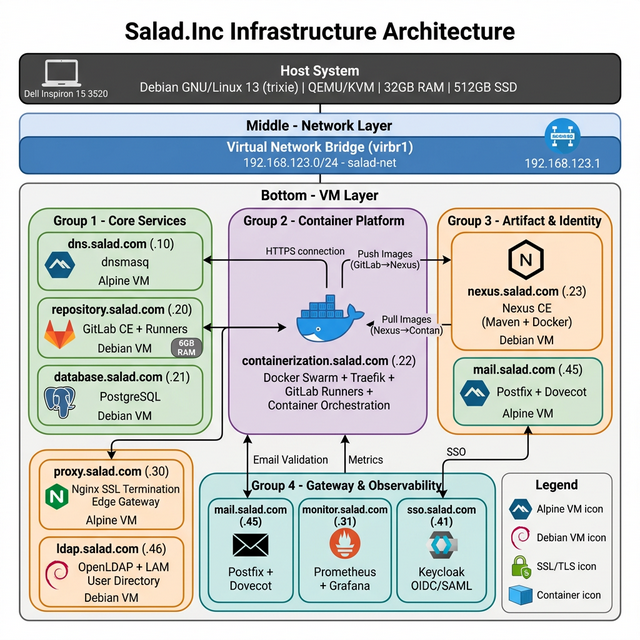
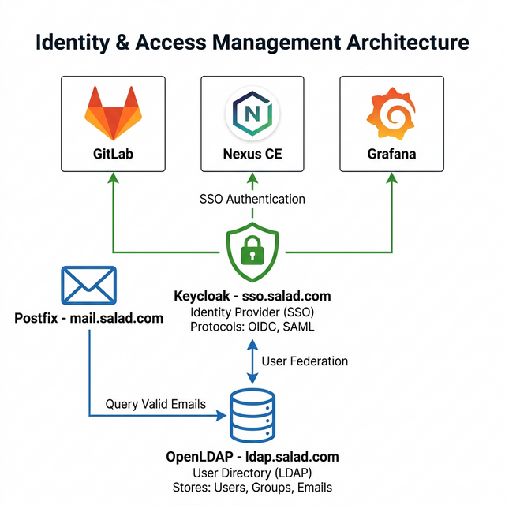
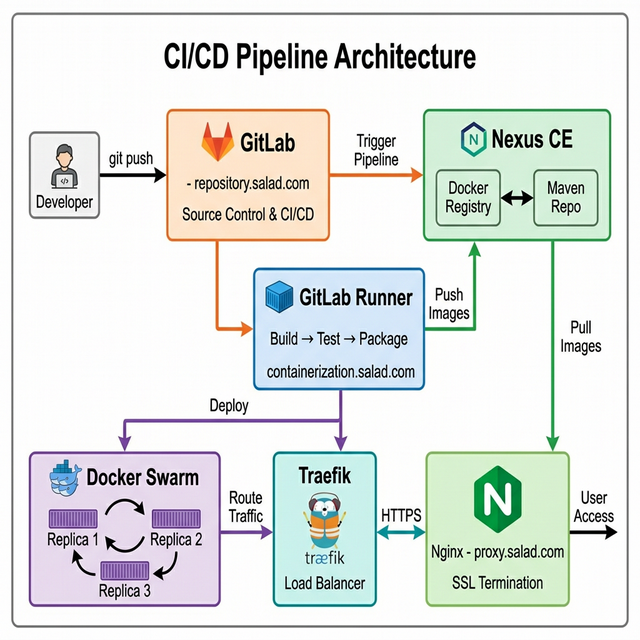
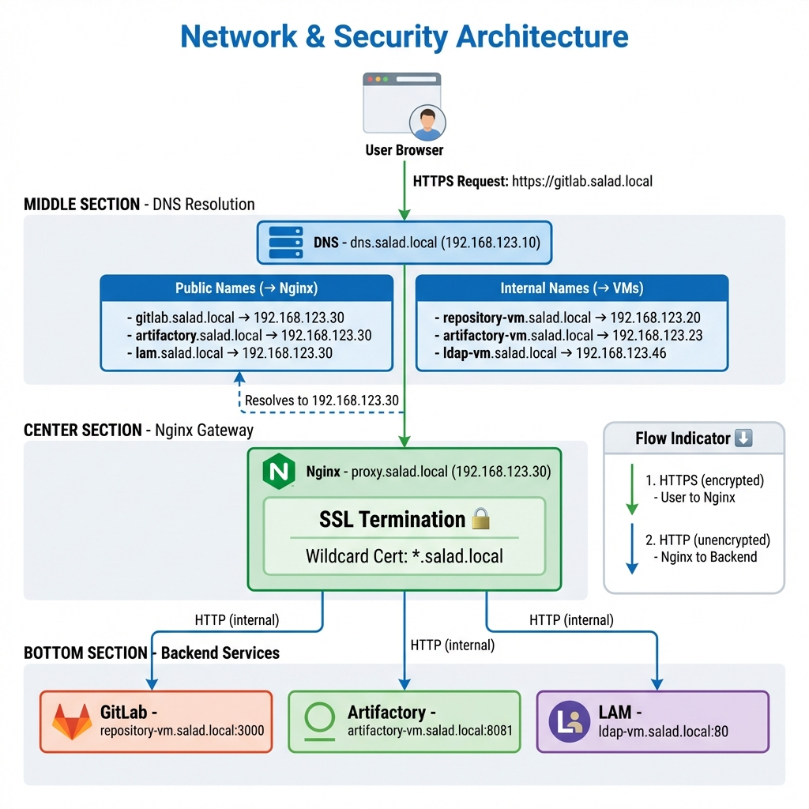

# Salad.Inc

I want to replicate the cycle of life and architecture of a tech company that create, maintain and ship applications. Qemu will play a significant role in this process, I will use it to create a virtual environment that will house the components of the company.

## Architecture Overview



The infrastructure consists of multiple VMs running on QEMU/KVM, connected via a virtual network bridge.

**Network Design:**
- All VMs communicate through a virtual bridge network (virbr0)
- Internal DNS resolution provided by dnsmasq
- Nginx serves as the main gateway and reverse proxy
- Centralized monitoring (Prometheus/Grafana) and logging (Loki)

**Key Data Flows:**
- Development: Developer → Proxy → Repository → Docker Host → Artifactory
- Observability: All services → Prometheus (metrics) & Loki (logs)
- Security: Nginx (SSL termination) + SSO/SAML (Keycloak)

The VMs/components I want to include are:

- Git repository and CI/CD using GitLab
- Database using PostgreSQL
- Container manager using Docker to run applications
- **Management UI using Portainer**
- Artifact Management using Sonatype Nexus Repository CE (Maven & Docker)
- Web server, reverse proxy and load balancer using Nginx
- Monitoring system using Prometheus and Grafana
- DNS server using dnsmasq
- Logging system using Loki
- SSO authentication using Keycloak

## Architecture Design

### Overview Diagrams

**Identity & Access Management:**


**CI/CD Pipeline Flow:**


**Network & Security:**


### Identity & Access Management

**User Directory (Single Source of Truth):**
- **OpenLDAP** (`ldap.salad.local`) stores all company users, groups, and email addresses
- Provides LDAP protocol access for services that need to query user data

**Identity Provider (SSO Gateway):**
- **Keycloak** (`sso.salad.local`) federates with OpenLDAP for user authentication
- Provides modern SSO protocols (OIDC/SAML) to applications
- All services with SSO support (GitLab, Artifactory, etc.) consume Keycloak

**Email Integration:**
- **Postfix** (`mail.salad.local`) queries OpenLDAP to validate email addresses
- Ensures only valid company users can send/receive mail

### Network & Security Architecture

**DNS Strategy (Dual-Entry Pattern):**
- **Service Names (UI)** → Point to Nginx (Edge Gateway)
  - `gitlab.salad.local` → 192.168.123.30
  - `nexus.salad.local` → 192.168.123.30
  - `lam.salad.local` → 192.168.123.30
  - `grafana.salad.local` → 192.168.123.30
  - `keycloak.salad.local` → 192.168.123.30
  - `portainer.salad.local` → 192.168.123.30
- **VM Names (Infrastructure)** → Point to actual VMs
  - `repository.salad.local` → 192.168.123.20
  - `database.salad.local` → 192.168.123.21
  - `containerization.salad.local` → 192.168.123.22
  - `artifact-repository.salad.local` → 192.168.123.23
  - `monitor.salad.local` → 192.168.123.31
  - `sso.salad.local` → 192.168.123.41
  - `mail.salad.local` → 192.168.123.45
  - `ldap.salad.local` → 192.168.123.46

**SSL/TLS Termination:**
- **Nginx** (`proxy.salad.local`) acts as the edge gateway
- Handles SSL termination using self-signed wildcard certificate (`*.salad.local`)
- Internal traffic between VMs uses HTTP (simpler, faster)
- Pattern: `https://service.salad.local` (Nginx) → `http://service-vm.salad.local:port` (Backend)

**Proxy Chain:**
```
User Browser
    ↓ HTTPS
Nginx (proxy.salad.local) - SSL Termination
    ↓ HTTP
Backend Service (actual VM)
```

### CI/CD Pipeline Architecture

**Source Control:**
- **GitLab** (`repository.salad.local`) hosts all application code
- Developers push code, triggering CI/CD pipelines

**Build & Test:**
- **GitLab Runners** (on `containerization.salad.local`) execute pipeline jobs
- Runners are containerized for isolation and scalability
- Pipeline stages: Build → Test → Quality Gates → Package → Push

**Artifact Storage:**
- **Nexus CE** (`nexus.salad.local`) stores build artifacts
  - **Docker Registry**: Container images built by GitLab CI (push via `registry-push.salad.local`, pull via `registry.salad.local`)
  - **Maven Repository**: Java artifacts + proxy to Maven Central
- GitLab pushes images to Nexus after successful builds

**Deployment:**
- **Docker Swarm** (on `containerization.salad.local`) orchestrates containers
  - Enables container replicas for high availability
  - Pulls images from Nexus CE
- **Traefik** (on `containerization.salad.local`) provides:
  - Dynamic service discovery (auto-detects containers)
  - Internal load balancing across replicas
  - HTTP routing based on container labels

**Application Access Pattern:**
```
User Request: https://myapp.salad.local
    ↓
Nginx (SSL termination, routes *.salad.local)
    ↓ HTTP
Traefik (dynamic routing, load balancing)
    ↓
Docker Swarm (container replicas)
    ↓
Application Container
```

### Pipeline Evolution

**Phase 1 (Current):**
```
Code Push → Build → Test → Push to Nexus → Deploy to Swarm
```

**Phase 2 (Future):**
```
Code Push → Build → Unit Tests → Code Quality (SonarQube) 
→ Security Scan (Trivy) → Integration Tests 
→ Push to Nexus → Deploy to Staging → Deploy to Production
```

### Service Integration Map

| Service | Integrates With | Purpose |
|---------|----------------|---------|
| **OpenLDAP** | Keycloak, Postfix | User directory |
| **Keycloak** | GitLab, Artifactory, Grafana, Portainer | SSO authentication |
| **GitLab** | Nexus CE, Docker (Runners) | CI/CD orchestration |
| **Nexus CE** | GitLab, Docker Swarm | Artifact storage (Maven + Docker) |
| **Docker** | GitLab, Nexus CE, Traefik | Container runtime |
| **Portainer** | Docker Swarm, Keycloak | Container management UI |
| **Traefik** | Nginx, Docker Swarm | Dynamic routing |
| **Nginx** | All UI services | SSL termination, edge gateway |
| **Prometheus** | All VMs (Node Exporter) | Metrics collection |
| **Grafana** | Prometheus, Loki | Visualization |


## Laptop config

In a best case scenario I'd like to run all those instances at my laptop so everything must be as lite as possible.

### Hardware Information:
- **Hardware Model:** Dell Inc. Inspiron 15 3520
- **Memory:** 32.0 GiB
- **Processor:** 12th Gen Intel® Core™ i5-1235U × 12
- **Graphics:** Intel® Iris® Xe Graphics (ADL GT2)
- **Disk Capacity:** 512.1 GB

### Software Information:
- **Firmware Version:** 1.34.0
- **OS Name:** Debian GNU/Linux 13 (trixie)
- **OS Build:** (null)
- **OS Type:** 64-bit
- **GNOME Version:** 48
- **Windowing System:** Wayland
- **Kernel Version:** Linux 6.12.57+deb13-amd64

## VM Resource Planning

Given the 32 GB RAM capacity, the infrastructure uses a **hybrid approach** with Alpine Linux for lightweight services and Debian for complex applications.

### OS Selection Strategy

| Distribution | Disk Space | RAM (Idle) | Boot Time | Best For |
|--------------|------------|------------|-----------|----------|
| **Alpine Linux** | ~130 MB base | ~20-40 MB | ~2-5s | DNS, Nginx, lightweight services |
| **Debian (minimal)** | ~500 MB base | ~60-100 MB | ~8-15s | Databases, complex apps, Java applications |

**Why Hybrid?**
- **Alpine**: 3-4x smaller footprint, faster boot, minimal overhead
- **Debian**: Maximum compatibility, extensive packages, familiar environment
- **Savings**: ~200-400 MB RAM, ~5-8 GB disk vs all-Debian approach

### VM Specifications

| IP | Hostname | Service | OS | vCPU | RAM | Disk |
|----|----------|---------|----|----|-----|------|
| 192.168.123.10 | dns.salad.local | dnsmasq | Alpine | 1 | 256 MB | 2 GB |
| 192.168.123.20 | repository.salad.local | GitLab + CI/CD | Debian | 2 | 6 GB | 20 GB |
| 192.168.123.21 | database.salad.local | PostgreSQL | Debian | 2 | 1 GB | 20 GB |
| 192.168.123.23 | nexus.salad.local | Sonatype Nexus CE (Maven + Docker) | Debian | 2 | 3 GB | 20 GB |
| 192.168.123.22 | containerization.salad.local    | Docker + Traefik + Portainer | Debian | 2 | 2 GB | 30 GB |
| 192.168.123.30 | proxy.salad.local | Nginx | Alpine | 1 | 512 MB | 5 GB |
| 192.168.123.31 | monitor.salad.local | Monitoring (Prometheus/Grafana) | Debian | 2 | 1.5 GB | 15 GB |
| 192.168.123.41 | sso.salad.local | SSO/SAML (Keycloak) | Debian | 2 | 2 GB | 10 GB |
| 192.168.123.45 | mail.salad.local | SMTP/IMAP (Postfix) | Alpine | 1 | 256 MB | 2 GB |
| 192.168.123.46 | ldap.salad.local | OpenLDAP + LAM | Debian | 1 | 512 MB | 5 GB |

### Resource Summary

**Total Allocated Resources:**
- **vCPUs:** 15 cores (laptop has 12 threads - slight overcommit is acceptable)
- **RAM:** 9.5 GB allocated to VMs
- **Disk:** 109 GB total (20% of 512 GB capacity)

**Memory Breakdown:**
```
Alpine VMs (2):    ~0.5 GB (256 MB + 256 MB)
Debian VMs (8):    ~14.5 GB (6 + 3 + 1 + 2 + 1.5 + 2 + 0.5 GB)
Host OS:           ~3-4 GB
Buffer/Cache:      ~13-14 GB
---------------------------------------------------------
Total in use:      ~17-18 GB (leaves plenty of room in 32 GB ✓)
```

**Performance Optimizations:**
- VMs use **virtio** drivers (paravirtualization for better I/O)
- Disk images use **qcow2** format with compression
- Swap disabled in VMs (reduces I/O contention)
- CPU overcommitment acceptable (VMs mostly idle)
- Dynamic RAM allocation considered for future optimization

## Documentation

I also want to document the whole process for future reference and better learning. I will use this repository to document the process. I want to create markdown files to act as a journal of the process.

## Project Constraints

- Alpine VM's will not take Cloud-Init to provision, they will be provisioned manually.
- Debian VM's will take Cloud-Init to provision.
- Each terminal command should be declared in a single code block.
- Each VM must have Node Exporter installed and configured to send metrics to the monitoring VM.
- Each VM initial setup must contains SSH public key authentication config.
- Swap must be disabled in all VMs to improve I/O performance.

## Pending Definitions

- To define pipeline types and their steps.

## Future Opportunities

- cAdvisor for container monitoring.
- Changing GitLab's Postgres and Redis to external VMs.
- Enable GitLab repositories to be replicated to a remote GitHub repository.
- To use Ansible to provision the VMs.
- To use Terraform to provision the VMs.
- To have separation between development and production environments. 